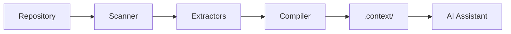
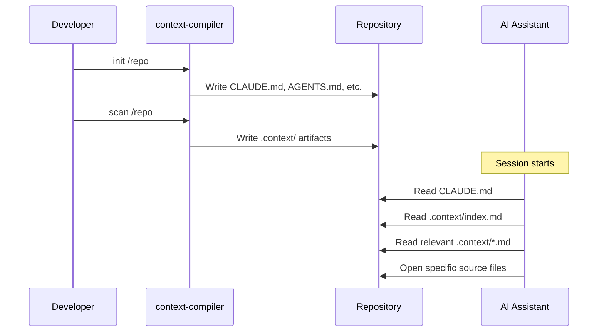
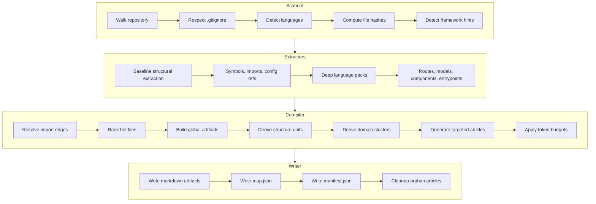
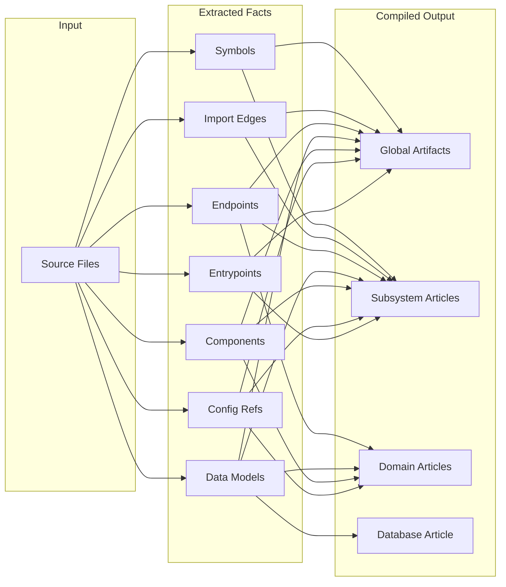

# context-compiler

> Turn any polyglot repository into a compact, AI-readable context layer.

Context-compiler scans a codebase, extracts structural facts using Tree-sitter, and compiles them into a small set of markdown and JSON artifacts. AI assistants read these artifacts at session start instead of scanning the repository themselves.

**Key properties:**

- No persistent database
- No MCP requirement
- No background indexer
- Deterministic, regenerable output
- Two runtime dependencies



## Table of Contents

- [Installation](#installation)
- [Quick Start](#quick-start)
- [Commands](#commands)
- [Workflows](#workflows)
- [Artifact Reference](#artifact-reference)
- [Architecture Overview](#architecture-overview)
- [Language Support](#language-support)
- [Development](#development)
- [Contributing](#contributing)
- [Further Reading](#further-reading)
- [License](#license)

## Installation

Requires Python 3.11 or newer.

### Using uv (recommended)

```bash
uv tool install context-compiler
```

### Using pip

```bash
pip install context-compiler
```

### From source

```bash
git clone <repo>
cd context-compiler
uv sync
uv run context-compiler --help
```

## Quick Start

```bash
# Initialize assistant instruction files
context-compiler init /path/to/repo

# Scan and generate context artifacts
context-compiler scan /path/to/repo

# Verify setup is current
context-compiler doctor /path/to/repo
```

After running `init` and `scan`, your repository contains:

```
repo/
├── CLAUDE.md                           # Claude Code instructions
├── AGENTS.md                           # Generic agent instructions
├── codex.md                            # Codex instructions
├── .github/
│   └── copilot-instructions.md         # GitHub Copilot instructions
└── .context/
    ├── index.md                        # Entry point (~300 tokens)
    ├── overview.md                     # Languages, directories, frameworks
    ├── architecture.md                 # Entry points, dependency edges
    ├── routes.md                       # API endpoints
    ├── schema.md                       # Data models
    ├── components.md                   # UI components
    ├── config.md                       # Environment variables
    ├── hot-files.md                    # Most-imported files
    ├── subsystem-*.md                  # Targeted articles per subsystem
    ├── domain-*.md                     # Cross-cutting domain articles
    ├── database.md                     # All data models consolidated
    ├── map.json                        # Machine-readable extracted facts
    └── manifest.json                   # Hashes for freshness detection
```

## Commands

### `context-compiler init <repo>`

Writes assistant instruction files into the repository.

**Files created/updated:**

| File | Purpose |
|------|---------|
| `CLAUDE.md` | Claude Code instructions |
| `AGENTS.md` | Generic agent instructions |
| `codex.md` | Codex instructions |
| `.github/copilot-instructions.md` | GitHub Copilot instructions |

Each file contains a managed block between `<!-- context-compiler:begin -->` and `<!-- context-compiler:end -->`. Content outside these markers is preserved. Re-running `init` is idempotent.

### `context-compiler scan <repo>`

Parses the repository and generates `.context/` artifacts.

**What it does:**

1. Walks the repository (respects `.gitignore`)
2. Parses supported files with Tree-sitter
3. Extracts structural facts (symbols, imports, routes, models, components, config)
4. Compiles facts into markdown artifacts with token budgets
5. Generates targeted articles for subsystems and domains
6. Writes `manifest.json` with hashes for freshness tracking

### `context-compiler doctor <repo>`

Validates that the context artifacts are fresh and complete.

**Checks performed:**

- Manifest exists and is readable
- Compiler version matches
- Source file hashes match
- Artifact file hashes match
- All expected artifacts exist
- No orphan article files

**Exit codes:**

| Code | Meaning |
|------|---------|
| `0` | Setup is current |
| `1` | Stale or missing artifacts (rescan needed) |

## Workflows

### Standard Workflow (No MCP)

Context-compiler operates without MCP. The intended loop:

1. Run `context-compiler init <repo>` once per repository
2. Run `context-compiler scan <repo>` when source changes
3. Assistant reads the generated instruction file (e.g., `CLAUDE.md`)
4. Instruction file directs assistant to `.context/index.md`
5. Assistant reads relevant `.context/*.md` files before opening source



### Targeted-Read Workflow

For focused questions, assistants can minimize token usage by reading only what they need:

| Step | What to read | Token budget |
|------|--------------|--------------|
| 1 | `.context/index.md` | ~300 tokens |
| 2 | One targeted article (`subsystem-*.md` or `domain-*.md`) | ~700-1200 tokens |
| 3 | Listed source files | Varies |

**Example:** "How does auth work?"

1. Read `index.md` → find `domain-auth.md` in routing hints
2. Read `domain-auth.md` → find key files, related routes, models
3. Open only the listed source files

This replaces the broad pattern of reading all global artifacts (~3000+ tokens) with a focused read (~1000 tokens + source).

### Broad-Context Workflow

For general orientation or unfamiliar codebases, read the global artifacts in order:

1. `.context/index.md` — Entry point and routing hints
2. `.context/overview.md` — Languages, directories, framework hints
3. `.context/architecture.md` — Entry points, dependency edges
4. `.context/routes.md` — API surface
5. `.context/schema.md` — Data models
6. `.context/components.md` — UI components
7. `.context/config.md` — Environment variables
8. `.context/hot-files.md` — Central files by import count

## Artifact Reference

### Global Artifacts

| File | Purpose | Token Budget |
|------|---------|--------------|
| `index.md` | Session-start routing, lists all articles | 300 (fixed) |
| `overview.md` | File counts, languages, directories, framework hints | 600–1000 |
| `architecture.md` | Entry points, module dependency edges | 900–1600 |
| `routes.md` | API endpoints with methods, paths, handlers | 1200–2400 |
| `schema.md` | Data models with fields | 900–1800 |
| `components.md` | UI components with props | 800–1600 |
| `config.md` | Environment variables and config references | 500–1000 |
| `hot-files.md` | Files ranked by import indegree/outdegree | 300–500 |

### Targeted Articles

| Pattern | Purpose | Token Budget |
|---------|---------|--------------|
| `subsystem-<name>.md` | Structure-based article for a top-level directory | 700–1200 |
| `domain-<name>.md` | Cross-cutting article for a domain (e.g., auth) | 700–1200 |
| `database.md` | All data models with fields and locations | 800–1600 |

### Adaptive Budgeting

Token budgets grow automatically based on extracted fact signals:

- **index.md** stays fixed at 300 tokens (safe to read first in any repository)
- Global artifacts grow in bounded tiers when their extracted signals exceed thresholds
- `routes.md` grows when endpoint count exceeds 20, 40, or 80
- `schema.md` grows when model count exceeds 10 or 20, and again when total field count exceeds 50
- Structure articles grow locally when subsystems have many files and facts
- Domain article budgets are repo-level and do not currently apply extra per-domain local growth
- All budgets are clamped to configured min/max bounds

Budgets grow from fact density, not repository size alone. A large monorepo with few routes will not inflate `routes.md`; a small service with many endpoints will.

**Configuration:** Tune budget bounds in `pyproject.toml`:

```toml
[tool.context-compiler.budgets]
mode = "adaptive"  # or "fixed" to disable growth

[tool.context-compiler.budgets.global]
routes_max = 2400
schema_max = 1800
# ... other bounds

[tool.context-compiler.budgets.articles]
article_max = 1200
database_max = 1600
```

**Subsystem articles** are generated for top-level directories like `api/`, `web/`, and `services/` when they contain enough files and facts (routes, models, components, config).

**Domain articles** are generated when 3 or more distinct signal types agree on a domain:

- Route paths (e.g., `/auth/login`)
- Route file names (e.g., `auth_routes.py`)
- Model names (e.g., `AuthToken`)
- Config names (e.g., `AUTH_SECRET`)
- Hot file names
- Import neighborhood file names

### Machine-Readable Files

| File | Purpose |
|------|---------|
| `map.json` | All extracted facts in JSON: symbols, edges, endpoints, models, components, config refs, articles |
| `manifest.json` | Compiler version, source hashes, artifact hashes, article file list |

### Article Sections

Each targeted article contains these sections (when applicable):

| Section | Priority | Content |
|---------|----------|---------|
| Title + Summary | Highest | What this area is, file/endpoint/model counts |
| Key Files | High | Most relevant source files with reasons |
| Routes | Medium | API endpoints in this area |
| Models | Medium | Data models in this area |
| Components | Medium | UI components in this area |
| Config | Low | Environment variables referenced |
| Also Inspect | Lowest | Related files in other subsystems (change hints) |

When an article exceeds its token budget, lower-priority sections are collapsed first.

## Architecture Overview

### Pipeline Stages



### Data Flow



### Key Data Structures

| Structure | Location | Purpose |
|-----------|----------|---------|
| `ScanInput` | `models.py` | Scanner output: files, framework hints |
| `ExtractedProject` | `models.py` | All extracted facts from a repository |
| `CompiledProject` | `models.py` | All compiled artifacts ready to write |
| `CompiledArticle` | `models.py` | A single targeted article |

For implementation details on relevance scoring, domain clustering, and budget enforcement, see [docs/internals.md](docs/internals.md).

## Language Support

### Phase-1 Deep Support

These languages have specialized extraction packs that produce rich, framework-aware facts:

| Language | Frameworks | Extracted Facts |
|----------|------------|-----------------|
| **TypeScript / TSX** | Express, React | Routes, components, config refs, entrypoints |
| **Python** | FastAPI, Flask, Django | Routes, models, settings/config, entrypoints |
| **Go** | Gin, net/http | Routes, grouped Gin routes, struct models, entrypoints |
| **Java** | Spring, generic | Routes, entity models, config refs, main() entrypoints |

Deep packs activate based on detected evidence. JavaScript framework hints come from `package.json`; Python, Go, and Java hints come from scanned source content; entrypoint detection can also trigger generic enrichment. Packs fail soft when individual files cannot be parsed.

### Script Support

| Language | Parser | Extracted Facts |
|----------|--------|-----------------|
| **Bash** | Tree-sitter | Functions, sourced-file imports, env vars |
| **PowerShell** | Tree-sitter | Functions, dot-sourced imports, env vars |
| **cmd/batch** | Lightweight regex | Labels, CALL imports, env vars |

### Generic Structural Support

These languages receive baseline Tree-sitter extraction (symbols, imports, config refs) without framework-specific enhancement:

- Rust
- C#
- Kotlin
- Swift
- Ruby
- PHP
- C / C++
- Scala
- Dart
- Lua

### Adding Language Support

See [docs/internals.md](docs/internals.md) for details on how language packs are structured and how to add new ones.

## Development

### Setup

```bash
git clone <repo>
cd context-compiler
uv sync --extra dev
```

### Running Tests

```bash
uv run pytest -q              # Run all tests
uv run pytest -v              # Verbose output
uv run pytest tests/test_compiler.py  # Specific file
```

### Linting

```bash
uv run ruff check .           # Check for issues
uv run ruff check . --fix     # Auto-fix issues
```

### Project Structure

```
context-compiler/
├── context_compiler/
│   ├── __init__.py
│   ├── cli.py                  # Typer CLI commands
│   ├── scanner.py              # Repository walking, file detection
│   ├── models.py               # Data structures
│   ├── compiler.py             # Fact compilation, global artifacts
│   ├── article_builder.py      # Targeted article generation
│   ├── relevance.py            # File scoring for ranking
│   ├── freshness.py            # Staleness detection
│   ├── artifact_writer.py      # Write .context/ files
│   ├── fs_utils.py             # Path utilities, token estimation
│   ├── instructions.py         # CLAUDE.md, AGENTS.md generation
│   ├── language_profiles.py    # Tree-sitter query profiles
│   ├── extractors/             # Language-specific extraction
│   ├── language_packs/         # Deep extraction packs
│   └── script_support/         # Bash, PowerShell, cmd support
├── tests/
│   ├── fixtures/               # Test repositories
│   ├── golden/                 # Snapshot files
│   └── test_*.py
├── docs/
│   ├── internals.md            # Implementation deep-dive
│   └── contributing.md         # Contribution guidelines
├── pyproject.toml
└── README.md
```

## Contributing

See [docs/contributing.md](docs/contributing.md) for:

- Code style guidelines
- Testing requirements
- How to add language support
- Pull request process

## Further Reading

- [docs/internals.md](docs/internals.md) — Implementation details: relevance scoring, domain clustering, budget enforcement, article generation algorithms
- [docs/contributing.md](docs/contributing.md) — Contribution guidelines and development workflow

## License

MIT License
