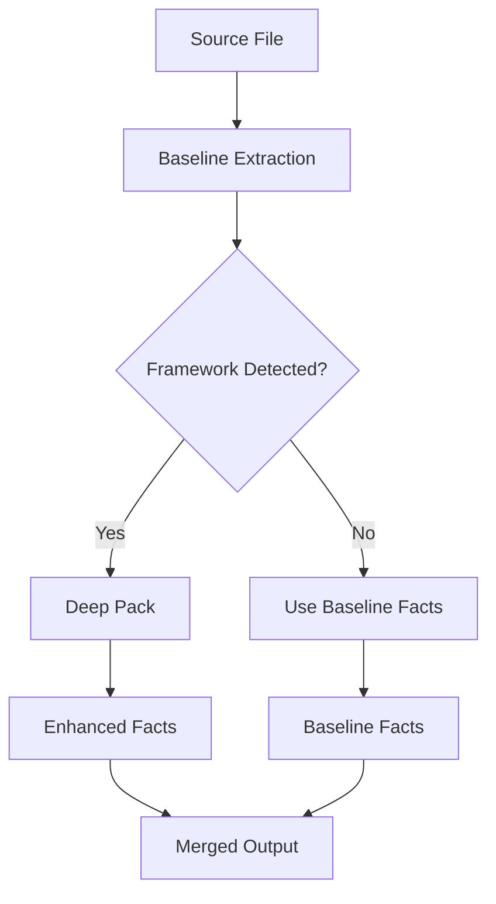

# Internals

This document describes the implementation details of context-compiler, including the extraction pipeline, relevance scoring algorithms, article generation logic, and budget enforcement strategies.

## Table of Contents

- [Extraction Pipeline](#extraction-pipeline)
- [Relevance Scoring](#relevance-scoring)
- [Article Generation](#article-generation)
- [Import Resolution](#import-resolution)
- [Freshness Detection](#freshness-detection)
- [Adding Language Support](#adding-language-support)

## Extraction Pipeline

### Scanner (`scanner.py`)

The scanner walks the repository and collects source files:

1. **Repository walking**: Recursively traverses directories starting from the root
2. **Gitignore handling**: Parses `.gitignore` and filters matching paths
3. **Built-in denylist**: Always excludes `.git`, `node_modules`, `.venv`, `__pycache__`, etc.
4. **Language detection**: Maps file suffixes to language identifiers (`.py` → `python`, `.ts` → `typescript`)
5. **Hash computation**: Computes SHA-1 hash of each file for freshness tracking
6. **Framework hints**: Detects frameworks from `package.json`, `requirements.txt`, `go.mod`, `pom.xml`

**Output:** `ScanInput` containing file list and framework hints.

### Baseline Extraction (`extractors/`)

Baseline extraction uses Tree-sitter to parse each file and extract structural facts:

| Fact Type | Description |
|-----------|-------------|
| **Symbols** | Functions, classes, methods with name, kind, line number |
| **Import Edges** | Import statements with source file, target path, raw text |
| **Config Refs** | Environment variable accesses (`os.getenv`, `process.env`) |
| **Doc Signals** | Module-level docstrings and comments |

Tree-sitter queries are defined in `language_profiles.py` for each supported language.

### Deep Language Packs (`language_packs/`)

Deep packs layer on top of baseline extraction to produce framework-aware facts:



**Pack structure:**

Each deep pack implements:

- `can_handle(file, framework_hints)` — Returns true if this pack should process the file
- `extract(file, baseline_facts)` — Returns enhanced facts

**Extracted facts by pack:**

| Pack | Endpoints | Models | Components | Config | Entrypoints |
|------|-----------|--------|------------|--------|-------------|
| TypeScript/TSX | Express routes | — | React components | process.env | — |
| Python | FastAPI, Flask, Django routes | Pydantic, Django models | — | os.getenv, settings | main(), app factories |
| Go | Gin groups, net/http handlers | Struct definitions | — | os.Getenv | main() |
| Java | Spring @RequestMapping | @Entity classes | — | @Value, Environment | main() |

### Fact Merging

When both baseline and deep packs extract the same fact (e.g., a route), the deep pack version wins because it includes richer metadata (framework provenance, handler names).

## Relevance Scoring

Relevance scoring (`relevance.py`) ranks files so that runtime code outranks tests, fixtures, and generated files.

### Path Classification

Files are classified by path patterns:

| Classification | Path Patterns | Base Score |
|----------------|---------------|------------|
| **Runtime** | Default (none of the below) | 100 |
| **Example** | `example/`, `demo/`, `sample/` | 40 |
| **Test** | `test/`, `tests/`, `__tests__/`, `*_test.py`, `*.test.ts` | 30 |
| **Fixture** | `fixture/`, `fixtures/`, `mocks/`, `stubs/` | 20 |
| **Generated** | `generated/`, `build/`, `dist/`, `node_modules/` | 10 |

### Score Boosts

Files receive additional score boosts based on their characteristics:

| Boost | Points | Condition |
|-------|--------|-----------|
| Explicit entrypoint | +50 | File is in `project.entrypoints` |
| Heuristic entrypoint | +25 | Filename is `main.py`, `app.ts`, `server.js`, etc. |
| Contains routes | +30 | File has extracted endpoints |
| Contains models | +25 | File has extracted data models |
| Contains components | +25 | File has extracted UI components |
| Contains config | +20 | File has extracted config refs |
| Hot file (indegree) | +3 per import | Capped at +30 total |
| Hot file (outdegree) | +1 per import | Capped at +30 total |

### Scoring Formula

```
total_score = base_score 
            + entrypoint_boost 
            + route_boost 
            + model_boost 
            + component_boost 
            + config_boost 
            + min(hotness_boost, 30)
```

### Example Scoring

| File | Base | Boosts | Total |
|------|------|--------|-------|
| `api/server.py` (entrypoint, routes) | 100 | +50 +30 | 180 |
| `api/models.py` (models, hot) | 100 | +25 +15 | 140 |
| `tests/test_api.py` | 30 | — | 30 |
| `fixtures/sample_data.py` | 20 | — | 20 |

## Article Generation

Article generation (`article_builder.py`) produces targeted articles from extracted facts.

### Article Caps

| Cap | Value | Purpose |
|-----|-------|---------|
| Max total targeted articles | 8 | Prevent article explosion |
| Max structure articles | 5 | Focus on main subsystems |
| Max domain articles | 3 | Only strongest domains |
| Max candidates to score | 20 | Large-repo guardrail |

The database article does not count toward the cap.

### Structure Article Derivation

Structure articles are generated for top-level directories that represent subsystems.

**Candidate collection:**

1. Group files by top-level directory prefix
2. Filter out weak prefixes: `tests/`, `fixtures/`, `scripts/`, `docs/`, `examples/`, etc.
3. Require at least 2 runtime files in the directory
4. Cap candidates at 20 before scoring

**Candidate scoring:**

```python
score = 0
score += min(file_count * 2, 20)           # More files = more substantial
score += min(fact_count * 3, 30)           # Routes, models, components, config
score += min(entrypoint_count * 5, 15)     # Entry points are strong signals
score += min(avg_relevance / 10, 15)       # Average file relevance
score += int(import_cohesion * 10)         # Internal import resolution rate
```

**Import cohesion:** Fraction of imports within the directory that resolve to files also in the directory. Higher cohesion indicates a more self-contained subsystem.

**Emission threshold:** Candidates with score < 15 are not emitted.

### Domain Article Derivation

Domain articles are generated for cross-cutting concerns when multiple signal types agree.

**Signal extraction:**

| Signal Type | Source | Example |
|-------------|--------|---------|
| Route path | Endpoint path segments | `/auth/login` → `auth` |
| Route filename | File containing routes | `auth_routes.py` → `auth` |
| Model name | Data model class name | `AuthToken` → `auth` |
| Config name | Environment variable | `AUTH_SECRET` → `auth` |
| Hot filename | High-connectivity file | `auth.py` → `auth` |
| Import filename | Frequently imported file | `auth/index.ts` → `auth` |

**Domain name extraction:**

- From paths: First non-version segment (`/api/v1/auth` → `auth`)
- From filenames: Directory name or stem, excluding generic names (`index`, `main`, `routes`)
- From names: First meaningful segment of camelCase/PascalCase (`AuthToken` → `auth`)

**Multi-signal evidence threshold:**

A domain article is only emitted when **3 or more distinct signal types** support it.

```python
# Good: 4 signal types
auth_candidate.fact_types = {"route_path", "route_filename", "model_name", "config_name"}
# → Emitted as domain-auth.md

# Bad: 1 signal type
users_candidate.fact_types = {"model_name"}
# → Not emitted (only User model exists)
```

**Tie-break rules for fact assignment:**

When a fact could belong to multiple domains, it is assigned to the highest-scoring domain:

1. Route-path evidence (strongest)
2. Route-filename evidence
3. Model/config evidence
4. Alphabetical (stable tie-break)

### Database Article

The database article is a special article that lists all data models:

- Generated when any runtime data models exist
- Does not count toward the 8-article cap
- Has a larger token budget (800 vs 700)
- Groups models by source file

### Also Inspect Hints

The "Also Inspect" section provides lightweight change hints without full blast-radius analysis.

**Sources for hints:**

1. **Import neighbors**: Files outside the subsystem that import from or are imported by files in the subsystem
2. **Shared routes**: Files in other subsystems that handle the same route paths
3. **Shared models**: Files in other subsystems that define models with the same names
4. **Shared config**: Files in other subsystems that reference the same config variables

Only runtime-like paths are included (tests and fixtures are filtered out).

## Adaptive Budgeting

The compiler uses adaptive budgeting to allocate space based on fact density rather than fixed limits.

### Budget Computation (`budgets.py`)

Budget computation happens after extraction and import resolution:

1. Load budget settings from `pyproject.toml` (or use defaults)
2. Extract project signals: file counts, endpoint counts, model counts, etc.
3. Compute per-artifact budgets using stepwise growth
4. Clamp all budgets to configured min/max bounds

### Stepwise Growth Model

Each artifact grows in discrete tiers when its signals cross thresholds:

```python
budget = clamp(base + step_size * triggered_tiers, min_budget, max_budget)
```

Example for `routes.md`:
- Base: 1200 tokens
- Tier 1: endpoint count > 20 (+300)
- Tier 2: endpoint count > 40 (+300)
- Tier 3: endpoint count > 80 (+300)
- Bonus tier: 150+ files AND 40+ endpoints (+300)
- Max: 2400 tokens

### Artifact Signals

| Artifact | Primary Signals |
|----------|-----------------|
| `overview.md` | Runtime file count, top-level directory count |
| `architecture.md` | Resolved import edges, entrypoint count |
| `routes.md` | Endpoint count, unique route paths |
| `schema.md` | Model count, total field count |
| `components.md` | Component count, total prop count |
| `config.md` | Unique config ref count |
| `hot-files.md` | Resolved import edge count |
| Structure article | Local file count, local fact count |
| Database article | Model count, total field count |

### Fixed Artifacts

`index.md` is always fixed at 300 tokens because:
- It is the session-start router
- It must remain safe to read first in every repository
- Broad growth here would weaken the targeted-read value proposition

### Fixed Mode

Setting `mode = "fixed"` in `pyproject.toml` disables adaptive growth and returns baseline budgets (matching the original behavior).

## Budget Enforcement

Each article has a token budget to keep context compact.

### Token Budgets

| Article Type | Budget Range |
|--------------|--------------|
| Structure article | 700–1200 tokens |
| Domain article | 700–1200 tokens |
| Database article | 800–1600 tokens |

### Token Estimation

Tokens are estimated as `len(text) // 4`, which approximates GPT-style tokenization.

### Section Priorities

When an article exceeds its budget, sections are collapsed in priority order:

| Section | Priority | Collapse Order |
|---------|----------|----------------|
| Summary | 100 | Last |
| Key Files | 90 | — |
| Routes | 80 | — |
| Models | 70 | — |
| Components | 60 | — |
| Config | 50 | — |
| Also Inspect | 40 | First |

### Collapse Strategy

```python
while estimate_tokens(markdown) > budget and len(sections) > 1:
    sections.pop()  # Remove lowest priority section
    markdown = rebuild(sections)

if estimate_tokens(markdown) > budget:
    # Final truncation with "...truncated to fit budget..." marker
    truncate_lines(markdown, budget)
```

## Import Resolution

Import resolution (`compiler.py`) attempts to resolve import targets to actual file paths.

### Resolution Strategy

1. **Direct match**: Target path exists in known files
2. **Suffix matching**: Try adding `.ts`, `.tsx`, `.js`, `.jsx`, `.py`, `.go`, `.java`
3. **Index file**: Try `<target>/index.ts`, `<target>/index.js`, etc.
4. **Java source roots**: Try `src/main/java/<target>.java`, `src/test/java/<target>.java`

### Resolution Marking

Each import edge has a `resolved: bool` field:

- `True`: Target file was found in the repository
- `False`: Target is external or unresolvable

Only resolved edges contribute to hot file rankings and import cohesion calculations.

## Freshness Detection

Freshness detection (`freshness.py`) determines if artifacts need regeneration.

### Manifest Structure

```json
{
  "compiler_version": "0.1.0",
  "scan_time": 1712966400,
  "source_hashes": {
    "api/server.py": "abc123...",
    "api/models.py": "def456..."
  },
  "artifact_hashes": {
    "index.md": "111222...",
    "overview.md": "333444...",
    "subsystem-api.md": "555666..."
  },
  "article_files": ["subsystem-api.md", "database.md"]
}
```

### Staleness Conditions

| Condition | Reason |
|-----------|--------|
| Missing manifest | Never scanned |
| Compiler version mismatch | Artifacts from old version |
| Source hash mismatch | Source files changed |
| Artifact hash mismatch | Artifacts were modified |
| Missing artifact files | Expected file doesn't exist |
| Orphan article files | Article exists but not in manifest |

### Orphan Detection

When articles are regenerated, some previous articles may no longer be emitted (e.g., a domain no longer has enough signals). The writer:

1. Reads previous `article_files` from manifest
2. Compares to newly generated articles
3. Deletes orphan files not in the new set

## Adding Language Support

### Adding a Generic Language

To add baseline structural support for a new Tree-sitter language:

1. Verify the grammar is available in `tree-sitter-language-pack`
2. Add the file suffix mapping to `fs_utils.py`:
   ```python
   LANGUAGE_BY_SUFFIX[".xyz"] = "xyz"
   ```
3. Add Tree-sitter queries to `language_profiles.py`:
   ```python
   "xyz": LanguageProfile(
       class_types=["class_definition"],
       function_types=["function_definition"],
       import_types=["import_statement"],
       import_target_types=["string"],
   )
   ```
4. Add tests in `tests/test_language_agnostic.py`

### Adding a Deep Language Pack

To add framework-aware extraction for a language:

1. Create `context_compiler/language_packs/<language>_pack.py`
2. Implement the pack interface:
   ```python
   def can_handle(file: SourceFile, hints: FrameworkHints) -> bool:
       ...
   
   def extract(file: SourceFile, project: ExtractedProject) -> None:
       # Mutates project to add/enhance facts
       ...
   ```
3. Register the pack in `extractors/__init__.py`
4. Add framework detection in `scanner.py` if needed
5. Add tests in `tests/test_deep_<language>.py`
6. Add fixture files in `tests/fixtures/`

### Testing Requirements

All language support additions require:

- Unit tests for extraction logic
- Fixture files demonstrating the patterns
- Integration test showing end-to-end compilation
